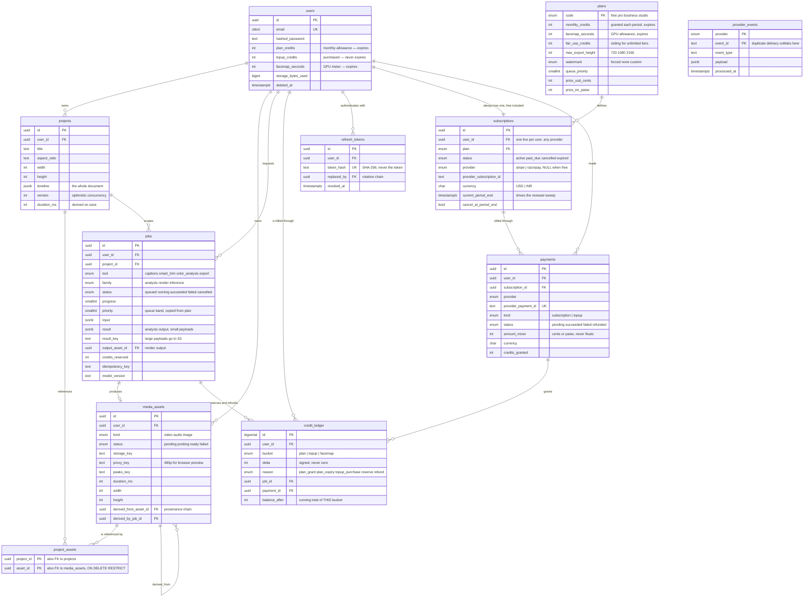
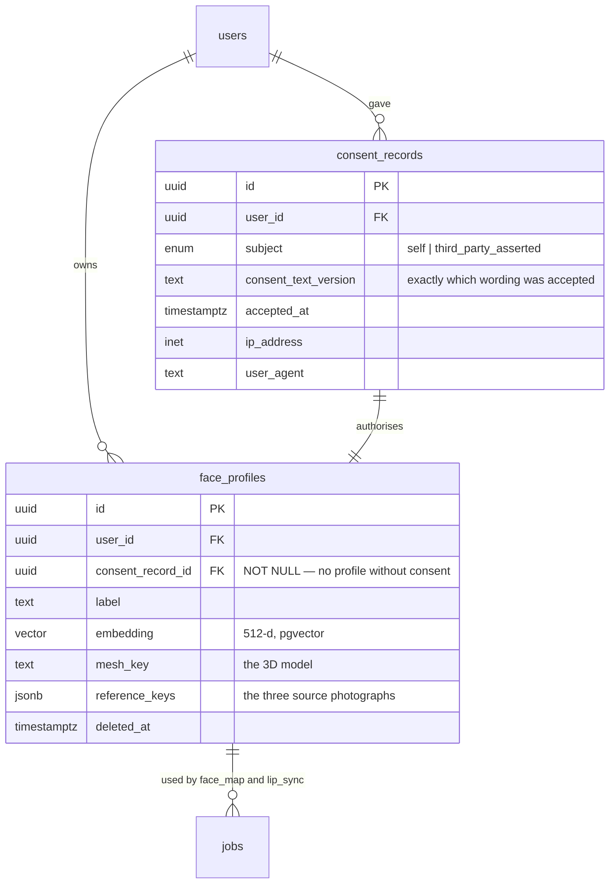
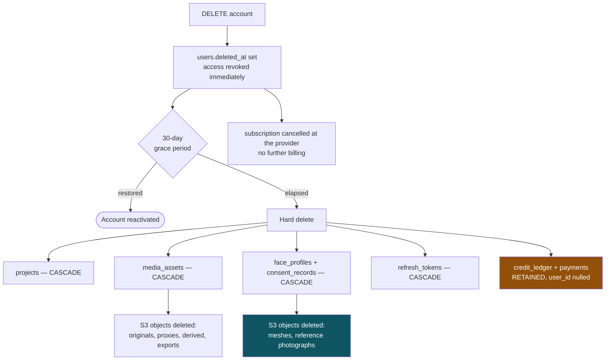
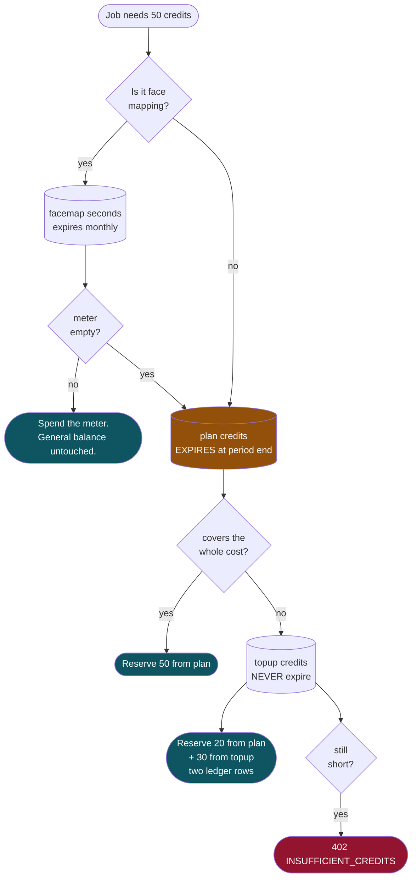

# Data Model

Entity relationships for the schema in [`../03-backend-architecture.md`](../03-backend-architecture.md) §4.

---

## 1. Phase 1

### Three relationships that carry the design

**`media_assets.derived_from_asset_id` — the self-reference.**
When a job rewrites pixels, it writes a *new* asset pointing back at its source. The clip swaps which asset it points at; the original is never touched. This one column is the whole of "revert to original".

**`project_assets` — the side table.**
The timeline lives as JSONB, which Postgres cannot join against. This table is rebuilt from the document on every save so that "which projects use this file?" stays a plain query. `ON DELETE RESTRICT` on `asset_id` means a file in use cannot be deleted out from under a project.

**`credit_ledger.bucket` with a unique index on `(job_id, reason, bucket)`.**
Credits arrive by different routes and expire on different schedules, so every movement names which kind it moved. A job that costs more than the expiring allowance holds draws from two buckets and writes two reservation rows — which is why the bucket is part of the key. One reservation and at most one refund *per bucket* per job, enforced by the database: a worker whose completion handler runs twice cannot refund twice.

---

## 2. Phase 2 additions

No existing table changes shape. The facial data attaches to `users` and is consumed by `jobs`.

`consent_record_id` is `NOT NULL` on purpose. A face profile cannot be created without recording what was agreed and when — retrofitting consent onto rows that already exist is the part of this work that goes wrong, and making it a constraint means it cannot be skipped under deadline pressure.

---

## 3. Deletion cascade

What happens when a user deletes an account, tracing the constraints above.

**Cancel the subscription at the provider on soft delete, not hard delete.** Waiting out the grace period means billing someone for a month after they asked to leave — the worst possible support conversation, and entirely avoidable.

The ledger and payment records are the one thing kept, anonymised, because financial records outlive accounts. Everything else goes, including every asset derived from a face profile — which is why `derived_from_asset_id` has to be walked, not just the directly-owned rows.

---

## 4. How credits are chosen when a job runs

Three balances, spent in a fixed order. The order is the whole point: it protects what the user paid for.

**Always the soonest to expire, first.** Drawing from `topup` before `plan` would let a user's monthly allowance quietly expire unused every month while the credits they paid extra for drained away. It looks like sharp practice, it generates refund requests, and it costs one line of code to avoid.

A refund returns credits to the buckets they came from, read back from the job's reservation rows. The one exception: if the billing period rolled over while the job was running, the refund goes to `topup` instead — refunding into a bucket that has already been swept and re-granted would credit a balance that no longer relates to the original charge.
