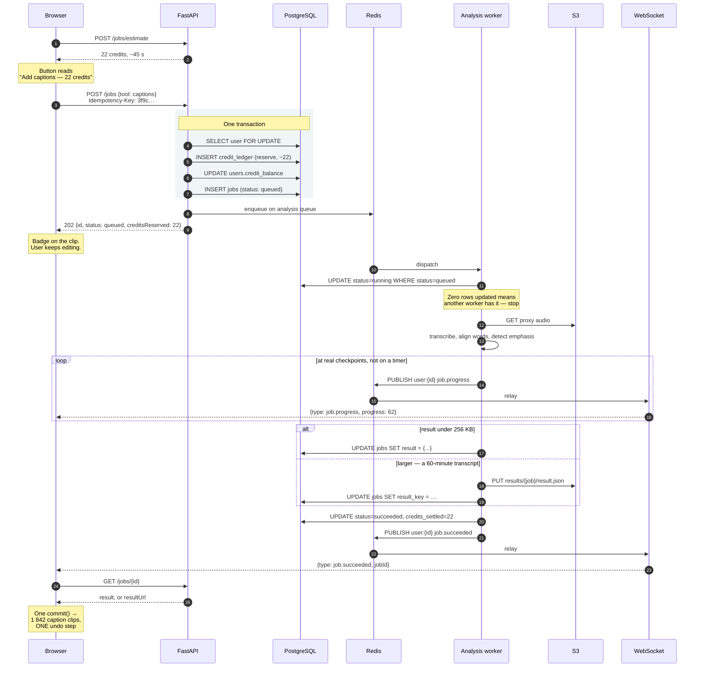
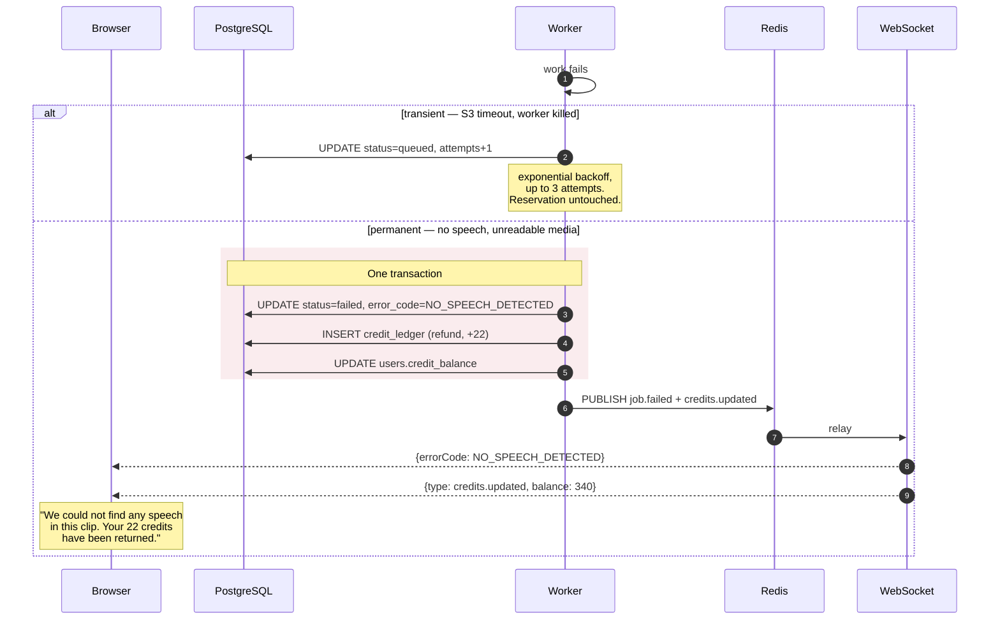
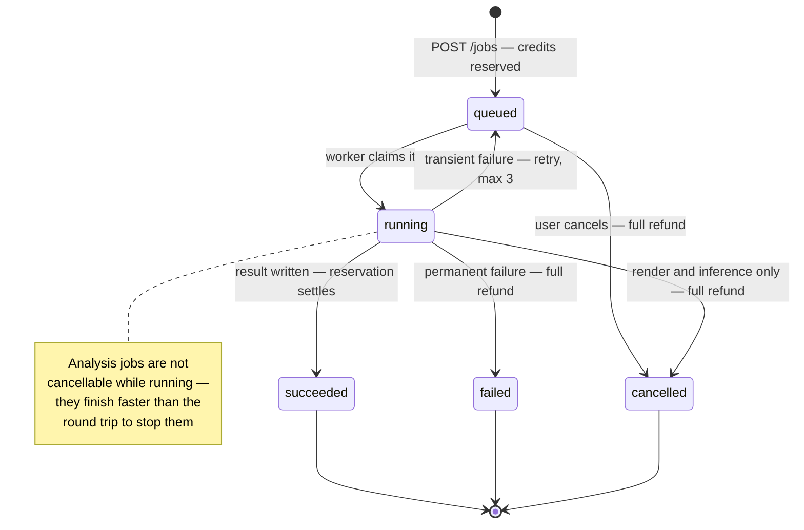
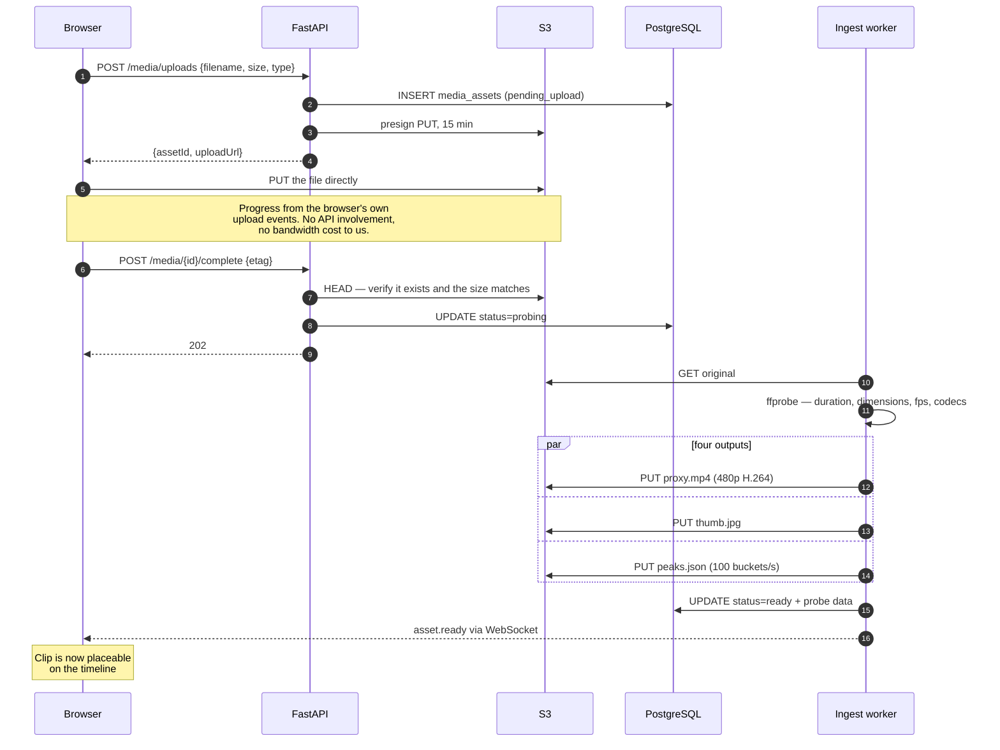
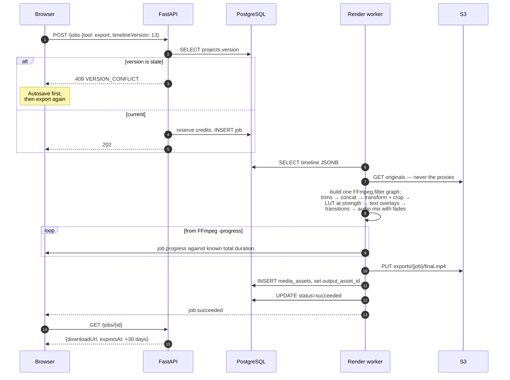

# Job Lifecycle

From invoking a tool to the result landing on the timeline, with every participant.
Referenced from [`../03-backend-architecture.md`](../03-backend-architecture.md) §5.

---

## 1. The happy path

Captions on a 10-minute clip. Note where money moves, and note that the user never waits.

The reservation is not a separate step from creating the job — steps 3 to 6 are one transaction. A job cannot exist unpaid, and a reservation cannot exist without its job.

---

## 2. Failure and refund

The user pays nothing for our failures, and nobody has to ask.

The unique index on `credit_ledger (job_id, reason)` means a completion handler that runs twice cannot refund twice — the second insert fails on the constraint rather than on a code path someone remembered to write.

---

## 3. States

---

## 4. Upload and ingest

Before any tool can run, media has to arrive and be prepared. The file never passes through the API.

The asset becomes `ready` only when all four outputs exist. A clip cannot be placed on a timeline before then — `duration_ms` is unknown until probing, and without it the timeline cannot lay it out or price a job against it.

---

## 5. Export

The one job that reads the timeline document rather than an asset.

The renderer reads the **saved** timeline, not the client's request body. A client cannot ask for something the stored project does not contain — which is why a stale `timelineVersion` is rejected rather than rendered.
