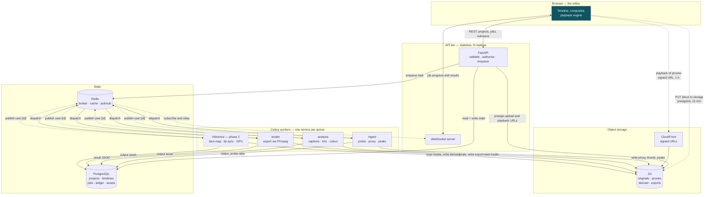
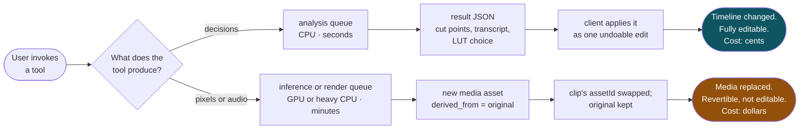
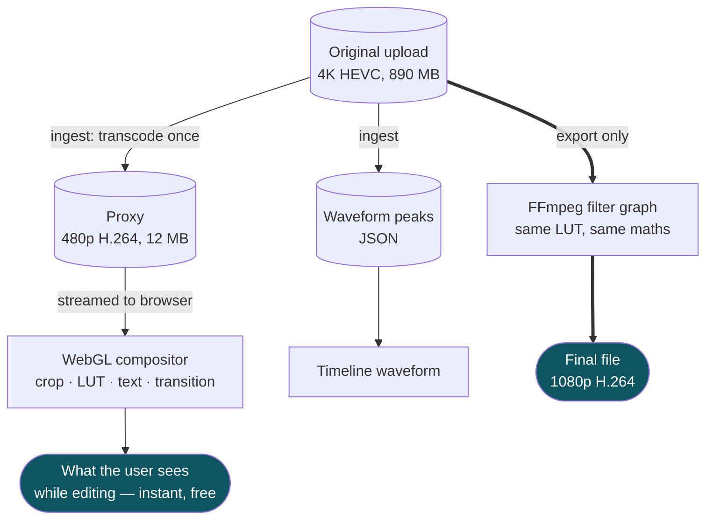

# System Overview

Component layout and what actually moves between the parts.
Referenced from [`../03-backend-architecture.md`](../03-backend-architecture.md) §3.

---

## 1. Components and traffic

Note the two edges that do **not** go through the API: the browser uploads to S3 directly, and plays media from the CDN directly. Only control traffic touches FastAPI. That is deliberate — media through a request handler is bandwidth we pay for twice and a failure mode we do not need.

Dashed border on `inference`: phase 2 only. Nothing else in this picture changes when it arrives — that is the point of the design.

---

## 2. The two job families

The single most consequential difference in the backend. Same table, same lifecycle, same notification path — but what comes back, and what it costs, diverge completely.

**Phase 1 uses only the left path**, plus `export` on the render queue. This is why phase 1 needs no GPU hardware, and why a new tool should always be pushed down the left path if it possibly can be.

---

## 3. Where a frame comes from, editing versus exporting

Two different media paths for two different jobs. Confusing them is why editors feel slow.

The original is touched exactly once during editing — at ingest — and once again at export. Everything in between runs on the proxy. **The LUT and its strength formula are shared between the compositor and FFmpeg**; if they drift, the user edits one picture and receives another.
